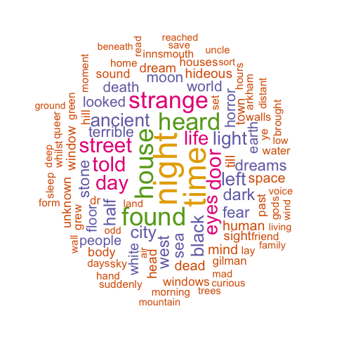
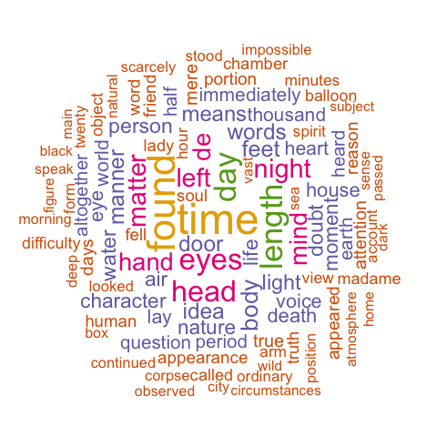
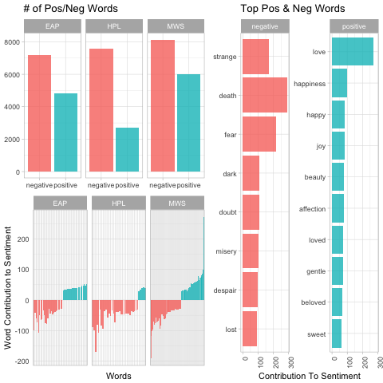

# Spring 2018
# Spooky Text Mining

----


### [Project Description](doc/project_description.Rmd)


Term: Spring 2018

+ Project title: *Spooky Text Mining*
+ Author: Sophie Beiers
+ Project summary: For this project, I used data consisting of excerpts of texts written by [Edgar Allen Poe](https://en.wikipedia.org/wiki/Edgar_Allan_Poe), [HP Lovecraft](https://en.wikipedia.org/wiki/H._P._Lovecraft) and [Mary Shelley](https://en.wikipedia.org/wiki/Mary_Shelley), all well-known horror authors. The data was originally used in a [Kaggle](https://www.kaggle.com/c/spooky-author-identification) competition with the goal of using NLP to classify and identify the author of each texts. For this particular project, I used exploratory data analysis and sentiment analysis in order to identify similarities and differences between the authors.


Following [suggestions](http://nicercode.github.io/blog/2013-04-05-projects/) by [RICH FITZJOHN](http://nicercode.github.io/about/#Team) (@richfitz). This folder is organized as follows.

```
proj/
├── lib/
├── data/
├── doc/
├── figs/
└── output/
```

Please see each subfolder for a README file.

## Summary of Findings
### Initial Look
To begin, I took a look into how long each author's sentences normally are as well as each author's typical word length.


From the visualizations, we can see that EAP's sentence length is more variable than the other two authors; he has more sentences that are short *and* long, and thus, actually has more sentences in the dataset overall than the two other authors. MWS and HPL's work follow similar trends in terms of sentence length, though it seems that MWS uses longer sentences slightly more frequently. The density chart shows us that the authors use similar word lengths throughout their work.

### Pronouns
Before removing "stop words" from each authors' pieces, I was curious to see which authors used certain personal pronouns more than others.


From the plot, we can see that MWS and EAP tend to talk about themselves more often than HPL. MWS writes about other women (her, she) more frequently than the male authors, perhaps not surprisingly. HPL seems to rarely refer to women in his work, though he is also seemingly less likely than the other authors to use pronouns in his writing at all.

### Most Common Words
After removing the "stop words" from each author's text to make analysis a bit more exciting, I visualized each author's top ten words used in his/her work.


Some of the authors' top ten most common words overlap; for instance, all three authors like to write about "time" and "day." We can also see, however, that the two male authors EAP and HPL have slightly more overlapping top words than with MWS. Both male authors frequently use the words "night" and "found." Other than the words all three authors have in common, EAP overlaps with MWS on the word "eyes" and HPL doesn't overlap with MWS at all. Given that MWS's top three words used are "life," "love," and "heart," we may assume that the content of MWS's work might be more emotional in nature compared to her male counterparts. Her frequent use of the name "Raymond" may be from her work "The Last Man."

To visualize each author's most frequent words further, I created three wordclouds.
#### Mary Shelley's "Wordcloud"


#### HP Lovecraft's "Wordcloud"



#### Edgar Allen Poe's "Wordcloud"



The wordclouds allow us to see that MWS's work is almost certainly more emotional than her counterparts'. Her work tends to paint a seemingly beautiful picture of nature, earth, family combined with suffering and grief. HPL's wordcloud exemplifies his use of creepier stories in his work. By linking together a few words like "street," "door," "horror," "dark," "terrible," "dream," "hideous," we can almost recreate a story ourselves. EAP's wordcloud doesn't immediately introduce an obvious (to me) theme other than potentially something spiritual, so I'll dig further through sentiment analysis.

### TF-IDF
After looking into each author's top 10 words, I want to identify each author's most used word that is also unique to his/her work. The "tf-idf" is known as the product of term and inverse frequency. The "tf" is the number of times a word appeared in a document or set of documents. The "idf" measures this frequency in relation to others. The weight for more commonly used words is decreased and the weight for words that aren't used very much in a collection of texts is increased. Thus, the "tf-idf" is "intended to measure how important a word is to a document in a collection of documents" ([TidyTextMining](https://www.tidytextmining.com/tfidf.html)). Words that MWS uses frequently that aren't used as much by the other authors are in blue; EAP's most common and unique words are in red and HPL's are in green.


Many of the unique and important words that the authors use are names (MWS used "perdita", "adrian", "raymond" and "idris" while HPL uses "gilman"and "wilbur"). EAP seems to be the only author that uses French frequently in his writing. These charts give us a good idea of what words we would look for if we needed to predict which author wrote a specific piece. Next, I turn to sentiment analysis to understand the emotions and feelings behind each author's work.

### Sentiment Analysis
Given all three authors have a known tendency toward "spooky" writing, I first wanted to assess whether sentiments of each author's words were more positive or negative. I used the "bing" lexicon to assess positive and negative sentiments and plotted the net sentiment of each word. The top left graph shows us how many negative and positive words the authors use overall. The graph to the right shows us the top ten most positive and most negative words used by all authors, and lastly, the bottom chart illuminates how many words contributed most to positive and negative sentiment, per author.




From my analysis, it looks as though MWS uses words that are more frequently categorized as positive as well as more words that are categorized as negative in comparison to both EAP and HPL. It's possible that MWS simply writes more words that are in the "bing" lexicon, but her positive words almost double HPL's number of positive words, so I want to dig a little further. I visualize the sentiment score of each author's top 1000 used words below with a heat map. Sentiment scores are based on the "AFINN" lexicon that gives a numerical assessment to each word; the more negative the number, the more negative the sentiment (and visa versa). A more positive word will appear as a light yellow/green and a negative word will appear more blue.  


The heatmap depicts each author's most commonly used words and their corresponding negative or positive sentiments. We can see chunks of both positive and negative words in all authors' writing, though MWS seems to have the lightest chunk of the group and HPL and EAP have darker chunks.

Ironically, while MWS seems to be the most "positive" author, she still uses a quarter more negative words than positive words in her pieces; this leads me to think that it's possible she may be negating the positive words in a way that makes the overall sentiment actually *negative.* Thus, I turn to the "sentimentr" package to analyze multiple words at a time and focus in on MWS.

### Zooming in: Mary Shelley
To examine whether MWS' high scores on positivity in her work was actually due to negated positive words, I used bigrams and the "AFINN" lexicon to view all words preceded by a negation; from the visualization, we can see which positive-seeming words contribute most to mis-classification.


The word "love" has a positive connotation, but in MWS's work, "love" clearly contributes to a large percent of negated words and thus an incorrect sentiment. I'd argue that the negatively associated words preceded by a negation word likely still contribute to an overall negative sentiment -- it's hard to come up with a truly positive sentence even when negating terms like "sorrow," "disgrace," and "dreadful."

Because "love" is a word quite commonly used by MWS, I look a bit further into words that come before or after "love" to get a better sense of how she means for the word to come across.


The top plot shows the most common words MWS uses before "love" in her work. Often, she's talking about her own love, and the words that follow seem primarily positive. The second visualization again cements the notion that MWS is usually speaking about something positive when she writes about love. However, it's clear that the "AFINN" lexicon couldn't fully represent sentiments of all of the preceding words; for instance, the words "mutual" and "love" combined normally would denote positivity, but "AFINN" doesn't have a sentiment for "mutual." I also noticed that MWS sometimes speaks about "unrequited" love, another word that the "AFINN" lexicon doesn't define as positive or negative.

#### K-means Clustering
Lastly, I ran a K-means analysis on specifically MWS's work. The analysis clustered her work into four clusters that seemed to fit into sensible categories, but this analysis ultimately did not reveal much more about the sentiments or tendencies of MWS's work.

### References
Some ideas and code were borrowed from [Text Mining in R](https://www.tidytextmining.com/), Cindy as well as Gokhan Ciflikli's [blog](https://www.gokhanciflikli.com/post/weinstein-effect/).
